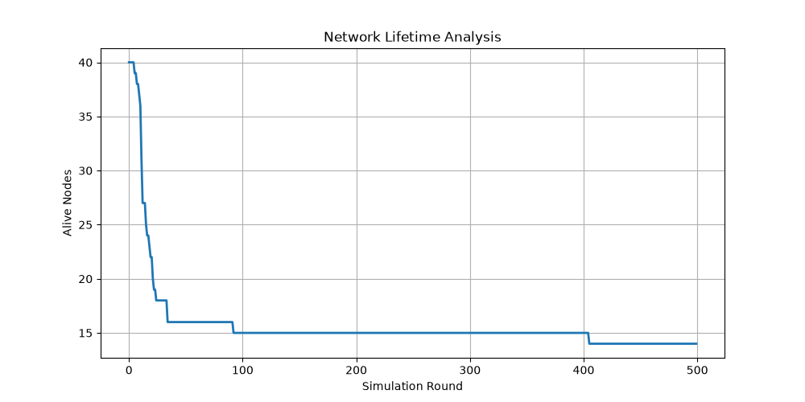
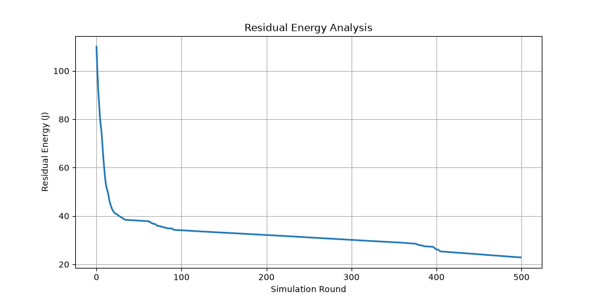
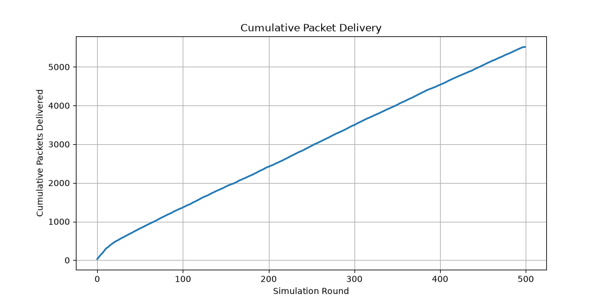
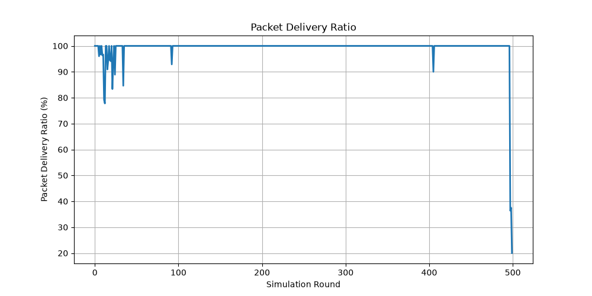
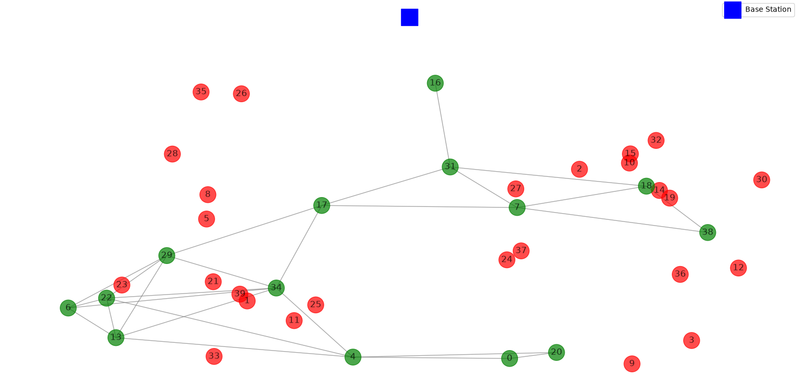

# Energy-Efficient Multi-Hop Routing in Wireless Sensor Networks (WSN)

## Overview

This project presents a Python-based simulation of an **Energy-Efficient Multi-Hop Routing Protocol** for **Wireless Sensor Networks (WSNs)**.

The simulation models a network of sensor nodes that communicate with a base station through direct or multi-hop communication while considering transmission energy and residual node energy.

The routing algorithm dynamically selects the next-hop node based on an energy-aware routing score that considers both communication cost and the remaining energy of neighboring nodes.

The simulator evaluates important Wireless Sensor Network performance metrics including:

- Network lifetime
- Residual energy
- Packet delivery performance
- Alive sensor nodes
- Network topology
- Node failures

---

## Features

- Energy-aware multi-hop routing
- Dynamic next-hop selection
- Residual energy-based routing
- First-order radio energy model
- Transmission and reception energy calculation
- Node failure simulation
- Network lifetime analysis
- Packet delivery analysis
- Cumulative packet throughput analysis
- Packet delivery ratio analysis
- Wireless sensor network topology visualization
- Performance graphs

---

## Technologies Used

- Python 3
- Matplotlib
- NetworkX
- Random
- Math

> `random` and `math` are Python standard-library modules and do not need to be installed separately.

---

## Project Structure

```text
Energy-Efficient-WSN-Routing/
│
├── wsn_simulation.py
├── README.md
├── requirements.txt
│
└── results/
    ├── network_topology.png
    ├── network_lifetime.png
    ├── residual_energy.png
    ├── cumulative_packets_delivered.png
    └── packet_delivery_ratio.png
```

---

## Simulation Parameters

| Parameter | Value |
|---|---:|
| Number of Sensor Nodes | 40 |
| Simulation Area | 100 × 100 units |
| Initial Energy per Node | 3.0 J |
| Base Station | (50, 120) |
| Maximum Simulation Rounds | 500 |
| Transmission Range | 40 units |
| Packet Size | 4000 bits |
| Random Seed | 42 |

The total initial network energy is:

```text
40 × 3.0 = 120.0 J
```

---

## Energy Model

The simulation uses a **First-Order Radio Energy Model**, where transmission energy depends on the communication distance.

For short-distance communication:

```text
Etx = Eelec × k + Eamp × k × d²
```

For long-distance communication:

```text
Etx = Eelec × k + Eamp × k × d⁴
```

where:

- **Eelec** = Electronic energy consumption
- **Eamp** = Amplifier energy
- **k** = Packet size
- **d** = Transmission distance

---

## Routing Algorithm

For each packet transmission, the simulator:

1. Selects an active sensor node.
2. Checks whether direct communication with the base station is possible.
3. Identifies active neighboring nodes when multi-hop routing is required.
4. Calculates transmission energy cost.
5. Considers residual energy of candidate next-hop nodes.
6. Calculates an energy-aware routing score.
7. Selects the next-hop node with the lowest score.
8. Forwards the packet using multi-hop communication.
9. Updates transmitter and receiver energy.
10. Marks nodes as dead when their energy is exhausted.

The routing score is:

```text
Routing Score =
Transmission Energy Cost / Residual Energy
```

This encourages lower-cost routes while considering the remaining energy of forwarding nodes.

---

## Performance Metrics

### Network Lifetime

- **FND (First Node Dead)** – Round when the first sensor node dies.
- **HND (Half Nodes Dead)** – Round when half of the original sensor nodes have died.
- **LND (Last Node Dead)** – Round when all sensor nodes have died.

### Residual Energy

Tracks the total remaining energy of the sensor network throughout the simulation.

### Cumulative Packet Delivery

Measures the cumulative number of successfully delivered packets over the simulation rounds.

### Packet Delivery Ratio

```text
PDR = (Packets Delivered / Packets Generated) × 100
```

### Alive Nodes

Tracks the number of active sensor nodes during the simulation.

---

## Simulation Results

The simulation was executed using a fixed **random seed of 42** to make the experiment reproducible.

### Network Configuration

```text
Initial Nodes: 40
Simulation Rounds: 500
Initial Total Energy: 120.00 J
Random Seed: 42
```

### Network Lifetime

```text
First Node Dead (FND): 5
Half Nodes Dead (HND): 21
Last Node Dead (LND): Not reached
```

### Packet Statistics

```text
Packets Generated: 5561
Packets Delivered: 5515
Packet Delivery Ratio: 99.17%
```

### Energy Statistics

```text
Initial Total Energy: 120.00 J
Final Total Energy: 22.88 J
Final Alive Nodes: 14
```

---

## Results and Visualizations

### Network Lifetime

The network starts with 40 active sensor nodes. Node failures occur as energy is consumed during communication.

At the end of 500 simulation rounds:

```text
Final Alive Nodes: 14
```

The last node was not reached within the 500-round simulation period.



### Residual Energy

The total network energy decreases as sensor nodes transmit and receive packets.

```text
Initial Energy: 120.00 J
Final Energy:   22.88 J
```



### Cumulative Packet Delivery

The simulator successfully delivered:

```text
5515 packets
```

out of:

```text
5561 generated packets
```



### Packet Delivery Ratio

The simulation achieved a packet delivery ratio of:

```text
99.17%
```



### Network Topology

The topology visualization shows the sensor nodes, communication links, and base station.

- Green nodes represent active sensor nodes.
- Red nodes represent nodes that have exhausted their energy.
- Blue square represents the base station.
- Edges represent available communication links.



---

## Round-by-Round Output

```text
Round   0 | Alive Nodes: 40 | Total Energy: 110.02 J | Packets Delivered: 29
Round  50 | Alive Nodes: 16 | Total Energy: 38.06 J | Packets Delivered: 823
Round 100 | Alive Nodes: 15 | Total Energy: 34.08 J | Packets Delivered: 1367
Round 150 | Alive Nodes: 15 | Total Energy: 33.08 J | Packets Delivered: 1903
Round 200 | Alive Nodes: 15 | Total Energy: 32.12 J | Packets Delivered: 2420
Round 250 | Alive Nodes: 15 | Total Energy: 31.13 J | Packets Delivered: 2957
Round 300 | Alive Nodes: 15 | Total Energy: 30.12 J | Packets Delivered: 3499
Round 350 | Alive Nodes: 15 | Total Energy: 29.14 J | Packets Delivered: 4021
Round 400 | Alive Nodes: 15 | Total Energy: 26.12 J | Packets Delivered: 4537
Round 450 | Alive Nodes: 14 | Total Energy: 24.15 J | Packets Delivered: 5043
```

---

## Results Summary

| Metric | Result |
|---|---:|
| Sensor Nodes | 40 |
| Simulation Rounds | 500 |
| Initial Network Energy | 120.00 J |
| First Node Dead (FND) | 5 |
| Half Nodes Dead (HND) | 21 |
| Last Node Dead (LND) | Not reached |
| Packets Generated | 5561 |
| Packets Delivered | 5515 |
| Packet Delivery Ratio | 99.17% |
| Final Total Energy | 22.88 J |
| Final Alive Nodes | 14 |

---

## How to Run

### 1. Clone the repository

```bash
git clone https://github.com/siddharthaporika/Energy-Efficient-WSN-Routing.git
```

### 2. Navigate to the project directory

```bash
cd Energy-Efficient-WSN-Routing
```

### 3. Install dependencies

```bash
pip install -r requirements.txt
```

### 4. Run the simulation

```bash
python wsn_simulation.py
```

The simulation will generate console statistics and performance visualizations.

---

## Future Improvements

Possible extensions include:

- Comparison with traditional shortest-path routing
- Comparison with LEACH-based routing
- Particle Swarm Optimization (PSO)
- Genetic Algorithm (GA)
- Ant Colony Optimization (ACO)
- Reinforcement Learning-based routing
- Mobile base station / mobile sink
- Heterogeneous sensor networks
- Energy balancing between relay nodes
- Fault-tolerant routing
- Larger-scale network simulations

---

## Author

**Siddhartha Porika**

Electrical Engineering  
Indian Institute of Technology Indore

---

## License

This project is intended for educational and research purposes.
